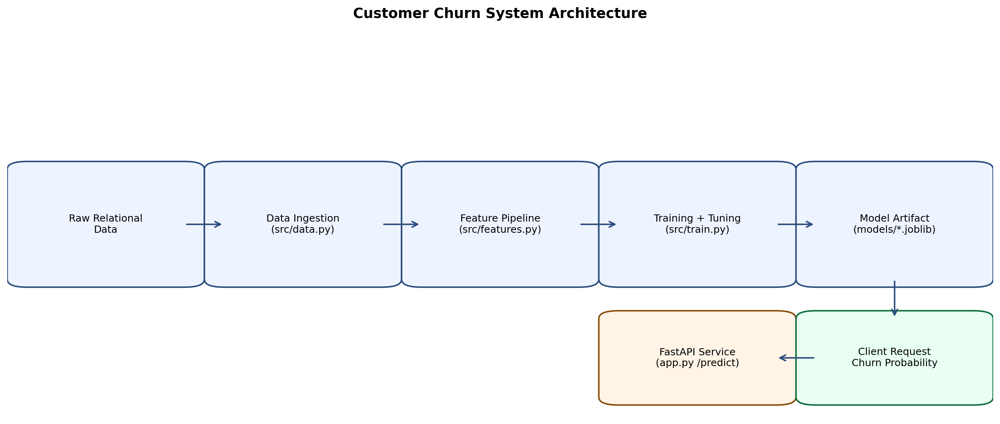
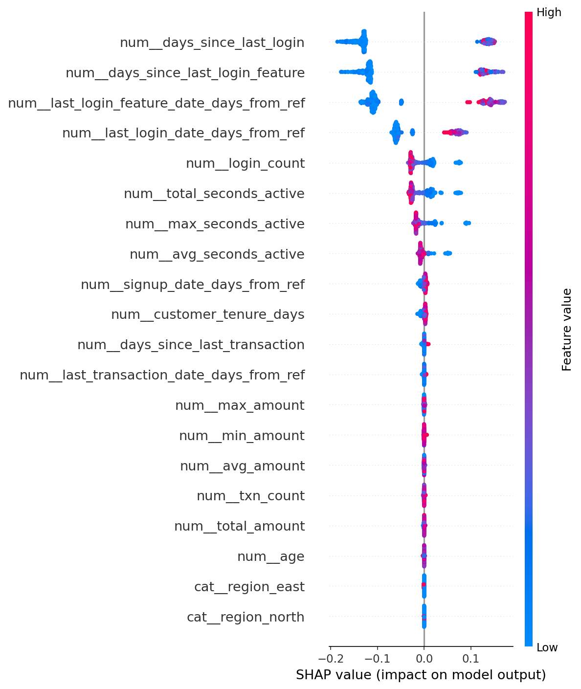
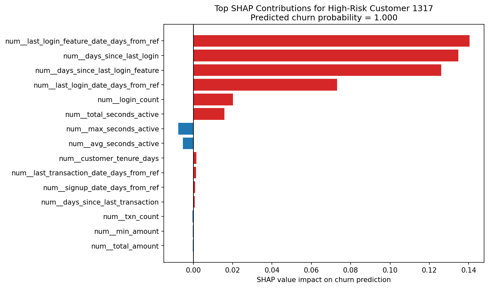

# End-to-End Predictive Intelligence System for Customer Churn

Production-style ML system that moves from messy relational data to deployable churn predictions with explainability.

## Business Problem

Company X is losing customers, but retention teams currently react too late.  
The objective is to predict churn probability early enough to trigger proactive campaigns (offers, outreach, product nudges) before churn happens.

## Solution Overview

This project implements a complete churn intelligence workflow using Python, Scikit-learn, SHAP, and FastAPI:

- generate and merge messy relational customer data into an analytical base table (ABT)
- engineer temporal and behavioral features suitable for churn prediction
- train and tune a classifier with leakage-safe preprocessing
- explain predictions with SHAP at global and customer level
- serve predictions through a validated FastAPI endpoint
- package the service with Docker

---

## Architecture Snapshot



Pipeline flow:

1. Relational data simulation (`customers`, `transactions`, `logs`)
2. ABT creation with customer-level temporal aggregates
3. Custom sklearn transformers + preprocessing pipeline
4. Model training + hyperparameter search
5. SHAP explanation artifacts
6. Serialized pipeline artifact
7. FastAPI inference endpoint (`/predict`)

---

## Key Technical Highlights

- Engineered complex temporal features from event streams:
  - `total_spend_last_30d`
  - `avg_transaction_value`
  - `days_since_last_transaction`
  - `txn_count_last_30d`
- Implemented custom sklearn transformers (`BaseEstimator`, `TransformerMixin`) in `src/pipeline.py`:
  - `CustomerTenureTransformer`
  - `DateRecencyTransformer`
- Built leakage-aware train/test workflow with end-to-end sklearn `Pipeline`.
- Added model interpretability with SHAP and auto-generated report figures.
- Implemented production-minded API with:
  - Pydantic request validation (`CustomerFeatures`)
  - startup/request/prediction logging
  - health endpoint + prediction endpoint
- Added unit tests for transformer correctness and pipeline load/predict path.

---

## Explainability Results

### Global Model Behavior (SHAP Summary)



Interpretation:

- recency and activity-related features dominate churn signal
- this supports business actionability: prioritize users with declining engagement patterns

### Customer-Level Explanation (High-Risk Example)



Interpretation:

- feature-level contribution bars explain why a specific customer is predicted as high risk
- useful for campaign personalization and account-manager context

---

## Repository Structure

```text
.
|-- app.py
|-- generate_messy_data.py
|-- simulate_messy_data.py
|-- requirements.txt
|-- Dockerfile
|-- src
|   |-- data.py
|   |-- data_gen.py
|   |-- pipeline.py
|   |-- train.py
|   `-- interpret.py
|-- scripts
|   `-- serialize_pipeline.py
|-- tests
|   `-- test_pipeline.py
|-- images
|   |-- system_architecture.png
|   |-- shap_summary_test_set.png
|   `-- shap_high_risk_customer.png
`-- docs
    `-- MAINTAINER_CONTEXT.md
```

---

## Quick Start (Local)

```bash
pip install -r requirements.txt
python src/data_gen.py
python src/train.py
uvicorn app:app --reload
```

Open:

- API docs: `http://127.0.0.1:8000/docs`
- health check: `http://127.0.0.1:8000/health`

---

## Run with Docker

```bash
docker build -t churn-api .
docker run -p 8000:8000 churn-api
```

---

## Automated Retraining (GitHub Actions)

This repository includes a scheduled/manual retraining workflow:

- file: `.github/workflows/retraining.yml`
- triggers:
  - manual (`workflow_dispatch`)
  - weekly schedule (Monday 03:00 UTC)

Workflow behavior:

1. installs dependencies
2. runs `python scripts/serialize_pipeline.py`
3. validates model + SHAP output files
4. generates `retraining_metadata.json` (includes model SHA-256)
5. uploads persisted artifacts to the workflow run

Persisted artifacts per run:

- `models/churn_pipeline.joblib`
- `models/shap_explainer.joblib`
- `reports/figures/shap_summary.png`
- `retraining_metadata.json`

Retention:

- artifacts retained for 90 days by default

Note:

- this workflow currently persists artifacts but does **not** auto-deploy them.

---

## API Usage

### Endpoint

- `POST /predict`
- `POST /explain` (returns top SHAP contributors for one prediction)

### Sample Request

```json
{
  "customer_id": 101,
  "signup_date": "2024-01-15",
  "region": "north",
  "age": 38,
  "txn_count": 5,
  "total_amount": 420.5,
  "avg_amount": 84.1,
  "avg_transaction_value": 84.1,
  "max_amount": 150,
  "min_amount": 20,
  "total_spend_last_30d": 120.0,
  "txn_count_last_30d": 2,
  "last_transaction_date": "2024-12-10",
  "days_since_last_transaction": 21,
  "login_count": 14,
  "total_seconds_active": 9000,
  "avg_seconds_active": 642,
  "max_seconds_active": 1200,
  "last_login_feature_date": "2024-12-20",
  "days_since_last_login_feature": 11,
  "last_login_date": "2024-12-20",
  "days_since_last_login": 11
}
```

### Sample Response

```json
{
  "churn_probability": 0.8731,
  "churn_prediction": 1
}
```

---

## Engineering Notes for Recruiters / Reviewers

- This repo intentionally demonstrates transition from DS experimentation to productionized ML:
  - modularized training stack in `src/`
  - reproducible artifact generation
  - inference API that consumes raw feature payloads
  - maintainability-focused documentation in `docs/MAINTAINER_CONTEXT.md`
- Synthetic data is used for reproducible demonstration.  
  In real deployments, replace `src/data.py` ingestion with warehouse/feature-store connectors while preserving the same training and serving contracts.

---

