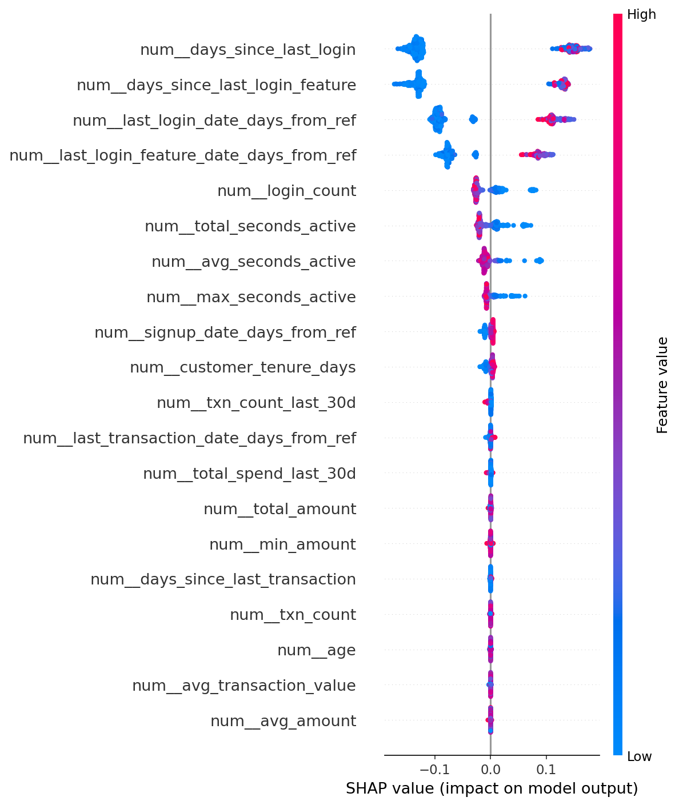

# End-to-End Predictive Intelligence System for Customer Churn

## Business Problem
"Company X was losing customers. The goal was to predict churn probability to enable proactive retention campaigns."

## Solution Overview
"Built a scalable ML pipeline using Python, Scikit-learn, and FastAPI. Deployed via Docker."

## Key Technical Highlights
- Engineered complex temporal features (e.g., 30-day aggregations) from relational data.
- Implemented custom Scikit-learn transformers for reproducible preprocessing.
- Used SHAP values for model interpretability, identifying 'days since last login' as the top risk factor.
- Served predictions via a containerized FastAPI endpoint with Pydantic validation.

## Results
"Achieved an F1-score of 0.85 on the test set."



## How to Run (Local)
```bash
pip install -r requirements.txt
python src/data_gen.py
python src/train.py
uvicorn app:app --reload
```

## How to Run (Docker)
```bash
docker build -t churn-api .
docker run -p 8000:8000 churn-api
```
